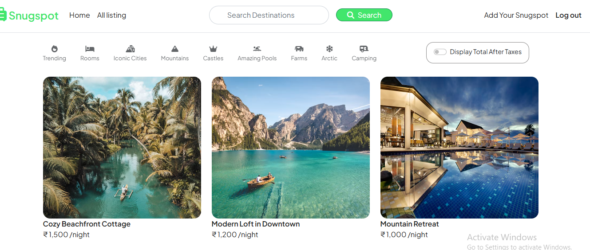

# 🏡 SnugSpot – Full-Stack Rental Listing Web App


---

## 📸 Screenshot  




---

## 🏡 SnugSpot – Rental Listing Platform

SnugSpot is a full‑stack rental listing platform where users can **create, browse, edit, and review property listings**.  
It includes secure **authentication**, **image uploads**, **reviews**, **maps**, and a clean MVC architecture.

Fully deployed on **Render**, offering fast listing management and seamless property discovery.

🔗 **Live Demo:** https://snugspot.onrender.com/

---

# ✨ Features

### 🏘 Property Listings  
- Create, edit, delete listings  
- Detailed listing pages  
- Multi‑image upload (Cloudinary)

### ⭐ Reviews & Ratings  
- Add/remove reviews  
- User‑based validation  

### 🔐 Authentication  
- Passport.js (Local strategy)  
- Secure sessions with connect‑mongo  
- Authorization for protected routes  

### 🗺 Maps (optional)
- Display property locations  
- Geocoding support  

### 🧱 Architecture  
- MVC structured  
- EJS templating  
- Middleware‑driven validation  
- Flash message alerts  

---

# 🛠 Tech Stack

### **Frontend**
- HTML, CSS, JS  
- Bootstrap  
- EJS Templates  

### **Backend**
- Node.js  
- Express.js  
- MongoDB + Mongoose  
- Passport.js  
- Joi  
- Multer + Cloudinary  
- express‑session + connect‑mongo  

---

# 📂 Project Structure

```
Snugspot/
├── controllers/
├── init/
├── models/
├── public/
├── routes/
├── utils/
├── views/
├── app.js
├── config.js
├── middleware.js
├── package.json
└── README.md
```

---

# 🔧 Installation

### 1️⃣ Clone Repo
```bash
git clone https://github.com/21R11A0426/Snugspot.git
cd Snugspot
```

### 2️⃣ Install Dependencies
```bash
npm install
```

### 3️⃣ Create .env  
```
CLOUDINARY_CLOUD_NAME=your_name
CLOUDINARY_KEY=your_key
CLOUDINARY_SECRET=your_secret

MONGO_URI=mongodb://localhost:27017/snugspot
SESSION_SECRET=your_secret
```

### 4️⃣ Start Server
```bash
node app.js
```

Visit:  
👉 http://localhost:3000

---

# 🧪 Core Routes

### Listings
| Method | Route | Action |
|-------|--------|--------|
| GET | /listings | All listings |
| GET | /listings/new | New listing form |
| POST | /listings | Create listing |
| GET | /listings/:id | Show listing |
| PUT | /listings/:id | Edit listing |
| DELETE | /listings/:id | Delete listing |

### Reviews
| Method | Route | Action |
|-------|--------|--------|
| POST | /listings/:id/reviews | Add review |
| DELETE | /listings/:id/reviews/:reviewId | Delete review |

### Auth
| Method | Route | Action |
|-------|--------|--------|
| GET | /register | Register page |
| POST | /register | Register user |
| GET | /login | Login page |
| POST | /login | Login |
| GET | /logout | Logout |

---

# 📡 Deployment
SnugSpot is deployed on **Render** using:

- Cloudinary for media storage  
- MongoDB Atlas  
- Node.js Web Service  

---

# 👤 Author
**Vikas Maldanngari**

🐙 GitHub: https://github.com/21R11A0426  
💼 LinkedIn: https://www.linkedin.com/in/maldannagari-vikas/  

